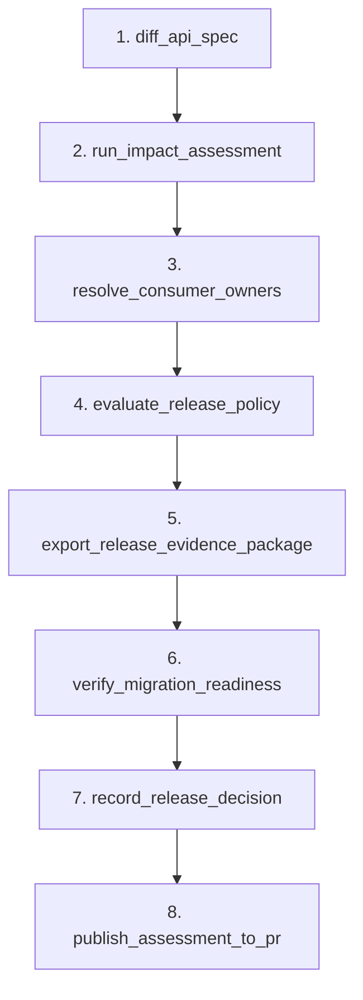

# NitroStack Studio Testing Guide for APIGuard Tools

This guide provides step-by-step instructions on **what exact inputs to enter** into each field in **NitroStack Studio** UI for all 13 APIGuard tools, including the recommended sequence to test the entire release governance pipeline.

---

## Recommended Testing Sequence (End-to-End Walkthrough)

To test the complete APIGuard workflow step-by-step in NitroStack Studio, follow this exact sequence:



---

## 1. `diff_api_spec`
**Purpose**: Compare baseline and candidate OpenAPI specifications to detect breaking API changes.

| Field Name | Value to Enter | Description |
| :--- | :--- | :--- |
| `scenarioId` | `risky` | Selects the pre-configured risky API change scenario. |

*Click **Run*** -> **Expected Result**: Output JSON showing 4 total changes (3 breaking: `id`, `name`, `email` removed from `/api/user`).

---

## 2. `run_impact_assessment`
**Purpose**: Run the full impact assessment workflow and generate a persisted `assessmentId`.

| Field Name | Value to Enter | Description |
| :--- | :--- | :--- |
| `scenarioId` | `risky` | Scenario identifier. |
| `snapshotId` | *(Leave empty)* | Auto-discovers latest evidence snapshot. |
| `forceRefresh` | `false` | Use cached/latest snapshot. |

*Click **Run*** -> **Expected Result**: An assessment object with a generated `id` (e.g. `asm_31bb9d91-d043-4fe7-8911-c459b6afe9d6`).  
👉 **IMPORTANT**: Copy the returned `id` value! You will use it as `assessmentId` in the next tools.

---

## 3. `resolve_consumer_owners`
**Purpose**: Match impacted file paths against repository `CODEOWNERS` rules.

| Field Name | Value to Enter | Description |
| :--- | :--- | :--- |
| `assessmentId` * | `asm_31bb9d91-d043-4fe7-8911-c459b6afe9d6` *(Paste your assessmentId from Step 2)* | Target Assessment ID. |

*Click **Run*** -> **Expected Result**: Ownership resolution with assigned/unresolved file counts and CODEOWNERS matches.

---

## 4. `evaluate_release_policy`
**Purpose**: Evaluate the release against 6 deterministic policy rules (POL-001 through POL-007).

| Field Name | Value to Enter | Description |
| :--- | :--- | :--- |
| `assessmentId` * | `asm_31bb9d91-d043-4fe7-8911-c459b6afe9d6` *(Paste your assessmentId)* | Target Assessment ID. |
| `profile` | `STRICT` | Select `STRICT` profile to enforce blocking rules. |

*Click **Run*** -> **Expected Result**: Verdict `BLOCK` due to POL-004 (breaking changes without major SemVer bump) and POL-007 (unowned code).

---

## 5. `export_release_evidence_package`
**Purpose**: Export an immutable, standalone JSON evidence bundle stored in `LocalArtifactStore`.

| Field Name | Value to Enter | Description |
| :--- | :--- | :--- |
| `assessmentId` * | `asm_31bb9d91-d043-4fe7-8911-c459b6afe9d6` *(Paste your assessmentId)* | Target Assessment ID. |

*Click **Run*** -> **Expected Result**: Output JSON containing `bundleId` (e.g. `pkg_2b11ee5553f5d089`) and `artifactUri`.  
👉 **IMPORTANT**: Copy the returned `bundleId` value!

---

## 6. `verify_migration_readiness`
**Purpose**: Verify if the evidence package is cleared for automated code migration tooling.

| Field Name | Value to Enter | Description |
| :--- | :--- | :--- |
| `bundleId` * | `pkg_2b11ee5553f5d089` *(Paste your bundleId from Step 5)* | Evidence package bundle ID. |

*Click **Run*** -> **Expected Result**: `readyForMigration: false` with explanation (`"Policy blocks or missing owners"`).

---

## 7. `record_release_decision`
**Purpose**: Record a formal human operator release approval or block decision.

| Field Name | Value to Enter | Description |
| :--- | :--- | :--- |
| `assessmentId` * | `asm_31bb9d91-d043-4fe7-8911-c459b6afe9d6` *(Paste your assessmentId)* | Target Assessment ID. |
| `expectedVersion` * | `1` | Must match current assessment version. |
| `decision` * | `BLOCK` | Select `BLOCK` (or `APPROVE`). |
| `reason` | `Blocking release due to unowned code and failing SemVer rules.` | Required human rationale. |
| `idempotencyKey` * | `op-decision-key-101` | Idempotency key preventing duplicate decisions. |

*Click **Run*** -> **Expected Result**: Decision recorded with state `BLOCKED_PENDING_MIGRATION`.

---

## 8. `publish_assessment_to_pr`
**Purpose**: Generate a formatted PR release-impact comment summary.

| Field Name | Value to Enter | Description |
| :--- | :--- | :--- |
| `assessmentId` * | `asm_31bb9d91-d043-4fe7-8911-c459b6afe9d6` *(Paste your assessmentId)* | Target Assessment ID. |
| `prUrl` * | `https://github.com/arckrisofficial/api-larp/pull/42` | Target Pull Request URL. |
| `idempotencyKey` * | `pr42_comment_key_1` | Idempotency key preventing duplicate comments. |

*Click **Run*** -> **Expected Result**: `publishedId` (e.g. `pub_1ab29887`) with markdown summary preview.

---

## Individual Utility Tools Reference

### `register_api_contract_pair`
Registers a custom OpenAPI baseline and candidate pair dynamically.
* `scenarioId`: `custom-test`
* `baselineSpec`:
```json
{
  "openapi": "3.0.3",
  "info": { "title": "Test API", "version": "1.0.0" },
  "paths": { "/status": { "get": { "responses": { "200": { "description": "OK" } } } } }
}
```
* `candidateSpec`:
```json
{
  "openapi": "3.0.3",
  "info": { "title": "Test API", "version": "2.0.0" },
  "paths": { "/v2/status": { "get": { "responses": { "200": { "description": "OK" } } } } }
}
```

### `refresh_repository_evidence`
Triggers a fresh GitHub code scan for a scenario.
* `scenarioId`: `risky`
* `repositories`: *(Leave empty or `["arckrisofficial/apiguard-react-consumer"]`)*
* `forceRefresh`: `true`

### `assess_consumer_risk`
Performs risk classification on evidence.
* `scenarioId`: `risky`

### `manage_repository_scope`
Adds or removes a GitHub repository from the scope.
* `action`: `ADD`
* `owner`: `arckrisofficial`
* `repository`: `apiguard-react-consumer`
* `reason`: `Adding React frontend consumer repository to scope.`
* `confirmed`: `true`

---

## Prompt Guide: `review_api_release`

### Is there anything to do in Prompts?
Yes! Prompts in NitroStack Studio allow LLMs / MCP clients to automate the entire APIGuard workflow in a single conversation.

We have updated the prompt **`review_api_release`** in `apiguard.prompts.ts`.

#### How to test `review_api_release` in NitroStack Studio:
1. Open the **Prompts** tab in NitroStack Studio.
2. Select **`review_api_release`**.
3. Fill in arguments:
   - `scenario_id`: `risky`
   - `release_context`: `PR #42 proposes removing user id, name, and email fields.`
4. Click **Run / Submit to Chat**.
5. The LLM will automatically execute all 5 core APIGuard tools in sequence:
   - `run_impact_assessment`
   - `resolve_consumer_owners`
   - `evaluate_release_policy`
   - `export_release_evidence_package`
   - `verify_migration_readiness`
