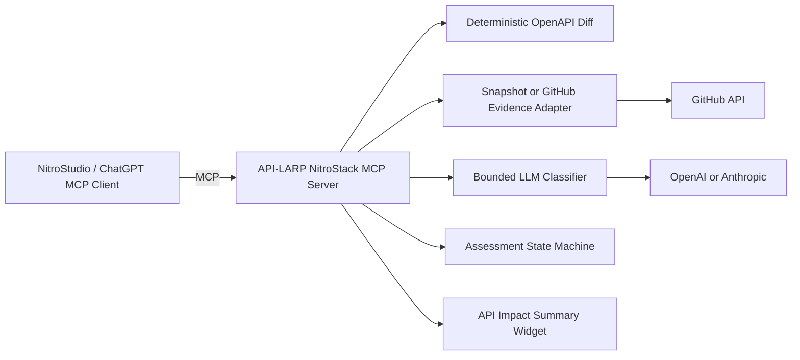

# API-LARP / APIGuard

**APIGuard connects provider-side OpenAPI changes to scoped consumer-code evidence and records a versioned human release decision through a real NitroStack MCP server.**

## Status

This repository contains the MCP server implementation, fixtures, widget, tests, Docker configuration and NitroCloud-ready project structure. The project was scaffolded manually to the current official NitroStack CLI layout after the execution VM could not reach `registry.npmjs.org`; on a normal machine, run the official CLI command shown below before comparing or replacing the scaffold.

```bash
npx @nitrostack/cli@latest init api-larp
```

## Why this is a real MCP server

- MCP client: NitroStudio AI Chat, Tools/Resources pages, ChatGPT or another compatible host.
- MCP server: this TypeScript application using `@nitrostack/core` decorators and DI.
- Registered surface: 5 tools, 3 resources, 1 prompt and 1 widget.
- External dependencies: GitHub and the LLM provider are internal server adapters, not MCP servers.

## MCP surface

### Tools

- `diff_api_spec`
- `discover_consumer_evidence`
- `assess_consumer_risk`
- `run_impact_assessment`
- `record_release_decision`

### Resources

- `apiguard://scenarios/{scenarioId}/specs/baseline`
- `apiguard://scenarios/{scenarioId}/specs/candidate`
- `apiguard://assessments/{assessmentId}`

### Prompt and widget

- Prompt: `review_api_release`
- Widget: `api-impact-summary`

## Quick start

Requirements: Node.js 20.18+, npm 9+ and NitroStudio.

```bash
cp .env.example .env
npm run install:all
npm run dev
```

Open this folder in NitroStudio using **Add MCP Server → Nitro Project → Studio App Canvas**.

### Guaranteed snapshot demo

```bash
npm run demo
```

This uses committed evidence and deterministic fallback classification. It needs no GitHub or LLM credentials.

### Snapshot evidence with the real bounded LLM classifier

```bash
# Set one provider key and USE_LLM=true in .env
npm run demo:llm
```

### Live GitHub mode

```bash
# Requires a read-only GitHub token and configured public repository allow-list.
npm run demo:live
```

Live mode is not the critical judging path because it can be affected by rate limits and network latency.

## Architecture



Business logic lives in injectable services. MCP controllers are thin decorator-based wrappers. All ESM imports use `.js` extensions.

## Deterministic versus LLM responsibilities

Deterministic code parses OpenAPI, resolves local references, detects structural changes, filters test/docs/generated files, validates model output, computes severity and applies release-decision transitions. The LLM only classifies ambiguous executable snippets and proposes scoped migration guidance.

## Supported diff subset

- OpenAPI 3.0 JSON
- Local `#/components/...` references
- Removed operation or parameter
- Parameter becoming required
- Required property removal
- Optional property becoming required
- Property type change
- Enum narrowing
- Optional property addition

Not supported: YAML, OpenAPI 3.1, remote references and complete polymorphic-schema compatibility.

## Tests

```bash
npm test
```

The offline VM-verifiable pure-domain tests can be run with:

```bash
npm run test:offline
```

## Build and production

```bash
npm run build
npm run start:prod
```

The build copies fixtures to `dist/fixtures`. Production automatically defaults to `dist/fixtures`; `APIGUARD_FIXTURES_DIR` is available only as an override.

## NitroStack alignment

See [`docs/NITROSTACK_ALIGNMENT.md`](docs/NITROSTACK_ALIGNMENT.md) for a requirement-by-requirement map to the official SDK, Studio, NitroCloud and supplied hackathon guidance.

## NitroCloud deployment

1. Push the public repository to GitHub.
2. Open NitroStudio and verify every tool, resource, prompt, widget and health check.
3. Connect NitroCloud and create an app/deployment from the repository.
4. Add environment variables from `.env.example` in the NitroCloud dashboard.
5. Deploy and wait for `Pending → Building → Deploying → Live`.
6. Connect the live Streamable HTTP/SSE MCP endpoint in NitroStudio and rerun the smoke flow.

## Judging smoke flow

1. Fetch the baseline resource.
2. Fetch the candidate resource.
3. Run `run_impact_assessment({scenarioId:"risky"})`.
4. Inspect the widget and provenance.
5. Call `record_release_decision` with `BLOCK` and a reason.
6. Fetch `apiguard://assessments/{assessmentId}` and verify the state changed.
7. Show the MCP traffic log and live NitroCloud URL.

## Security and honesty

- Repository snippets are untrusted data.
- The internal model receives no tools.
- Model output is Zod-validated.
- Failure becomes `REVIEW_REQUIRED`, not a green result.
- Tokens and `.env` are never committed.
- Snapshot mode is labelled visibly.
- Search is scoped evidence collection, not complete dependency discovery.
- The MVP records a governed decision; it does not enforce CI branch protection.

## Before submission

Replace placeholder snapshot repositories and commit SHAs with a snapshot generated from the team's real public demonstration repositories. Then run the workflow three times, test the NitroCloud deployment, record the maximum three-minute video and submit the public repository through the required Sample Apps and NitroCloud flow.


## Verification status in the build VM

The VM used to prepare this package had no outbound DNS access to `registry.npmjs.org`, so the requested `npx @nitrostack/cli init api-larp` command could not download the CLI. The requested exact command and the registry failure are preserved in `docs/CLI_EXACT_ATTEMPT.txt`; the earlier latest-version attempt is in `docs/CLI_ATTEMPT.txt`. The project was therefore scaffolded to the current official NitroStack CLI structure and SDK examples. Pure TypeScript domain tests were executed in the VM. A real `npm install`, NitroStack build, NitroStudio connection and NitroCloud deployment must be run on a networked machine before submission.
