# APIGuard

**APIGuard turns an OpenAPI contract change into a versioned, evidence-backed release decision, then generates reviewable consumer-code fixes and draft GitHub pull requests through a real NitroStack MCP server.**

Built for the NitroStack × MCP To The Moon Buildathon.

## What is real MCP here?

The TypeScript application in `src/` is the MCP server. It registers typed tools, read-only resources, a reusable prompt, and an interactive NitroStack widget. NitroStudio, NitroChat, or another MCP-compatible host is the client. GitHub and the selected model provider are downstream services called behind MCP tools; they are not separate MCP servers.

### Public MCP tools

| Tool | Responsibility |
|---|---|
| `register_api_contract_pair` | Registers inline baseline and candidate OpenAPI 3.0 JSON contracts. URL fetching is intentionally unsupported. |
| `diff_api_spec` | Resolves local references, normalises operations/schemas, and emits deterministic compatibility changes. |
| `collect_consumer_evidence` | Collects provenance-tagged code evidence from a reproducible snapshot or a configured live GitHub scope. |
| `assess_consumer_risk` | Applies deterministic filters and one bounded, schema-validated model call only to ambiguous production evidence. |
| `run_impact_assessment` | Runs the complete reliable workflow and persists a versioned assessment. |
| `record_release_decision` | Records an idempotent human approval or block decision. |
| `propose_consumer_fixes` | Generates a reviewable source-code migration plan. It never writes to GitHub. |
| `create_migration_pull_requests` | After explicit confirmation, writes only to allow-listed repositories and creates draft PRs. It never merges. |

### MCP resources

- `apiguard://scenarios`
- `apiguard://scenarios/{scenarioId}/specs/baseline`
- `apiguard://scenarios/{scenarioId}/specs/candidate`
- `apiguard://evidence-snapshots/{snapshotId}`
- `apiguard://assessments/{assessmentId}`
- `apiguard://fix-plans/{fixPlanId}`

### Prompt and widget

- Prompt: `review_api_release`
- Widget: `api-impact-summary`

## Core workflow

```mermaid
flowchart LR
  C[NitroStudio / NitroChat MCP client] -->|MCP| S[APIGuard NitroStack MCP server]
  S --> D[Deterministic OpenAPI diff]
  D --> E[Snapshot or live GitHub evidence]
  E --> R[Deterministic filters + one bounded model call]
  R --> A[Versioned assessment]
  A --> H[Human approve or block]
  H --> F[Reviewable fix plan]
  F -->|explicit confirmation| P[Draft GitHub PRs]
```



The orchestrator calls shared services directly. It does not recursively invoke its own MCP tools.

## Deterministic versus model responsibilities

**Deterministic:** OpenAPI validation, local `$ref` resolution, compatibility changes, test/documentation/generated-code filtering, provenance, severity aggregation, Zod validation, assessment state transitions, file-hash checks, branch allow-listing, and draft-PR creation.

**Model-assisted:** classifying genuinely ambiguous executable snippets and proposing minimal complete-file replacements. Source code is treated as untrusted input, the model receives no tools, and output that fails validation degrades to `REVIEW_REQUIRED` rather than a green result.

## Supported OpenAPI subset

APIGuard intentionally supports OpenAPI 3.0 JSON and local component references. The implemented semantic checks include:

- operation removal
- parameter removal, addition as required, or becoming required
- a new required request body
- removal of a declared success-response schema
- required response-property removal or becoming optional
- request properties becoming required
- property type changes
- request enum narrowing and response enum widening
- optional-property additions
- fail-closed manual-review records for polymorphic constructs outside the subset

It does not claim full OpenAPI 3.1, YAML, remote references, or complete polymorphic-schema compatibility.

## Quick start

### Requirements

- Node.js 20+
- npm 9+
- NitroStudio for visual MCP inspection

### Guaranteed snapshot demo

```bash
git clone <repository-url>
cd apiguard
npm ci
npm run demo
```

This path requires no GitHub token and no model key. It uses committed provenance-tagged evidence and deterministic classifier/fix fixtures. The output labels these modes honestly.

### Snapshot evidence plus a real model

```bash
cp .env.example .env
# Set USE_LLM=true, LLM_PROVIDER, and one provider key.
npm run demo:llm
```

Supported providers:

- `openai`
- `anthropic`
- `gemini`

All providers go through the same structured `ModelGateway` contract and Zod validation.

### Live GitHub evidence

```bash
cp .env.example .env
# Configure GITHUB_TOKEN, DEMO_GITHUB_OWNER, and DEMO_GITHUB_REPOSITORIES.
npm run demo:live
```

Live mode is intentionally limited to the configured repository scope. It does not claim complete dependency discovery. The snapshot path remains the recommended judged demo because it is reproducible and not rate-limit dependent.

## Consumer fix and pull-request flow

1. Run `run_impact_assessment`.
2. Block the release through `record_release_decision` when consumer migration is required. Approval ends the workflow.
3. For a blocked assessment with confirmed or likely impacts, call `propose_consumer_fixes`.
4. Fetch `apiguard://fix-plans/{fixPlanId}` and review every complete-file replacement.
5. To permit GitHub writes, configure:

```dotenv
APIGUARD_GITHUB_WRITE_ENABLED=true
APIGUARD_WRITABLE_REPOSITORIES=owner/react-consumer,owner/python-consumer
GITHUB_TOKEN=...
```

6. Explicitly call `create_migration_pull_requests` with `confirmed: true`.

Safety guarantees in the prototype:

- writes are disabled by default
- only exact allow-listed `owner/repository` values are accepted
- base branch head must still equal the pinned evidence commit
- source file hashes are revalidated before writing
- a namespaced branch is created
- pull requests are drafts by default
- APIGuard never merges or writes directly to the default branch
- bundled fixture repositories are read-only

The GitHub token used for PR creation needs repository contents write and pull-request write permissions. Use the narrowest fine-grained token possible.

## Development and validation

```bash
npm run typecheck
npm test
npm run widget:typecheck
npm run build
npm run test:e2e
```

Run the complete CI-equivalent check:

```bash
npm run ci
```

GitHub Actions runs with external models, live GitHub evidence, and GitHub writes disabled. Tests mock model-provider protocols and GitHub write operations.

## Snapshot refresh

```bash
GITHUB_TOKEN=... \
DEMO_GITHUB_OWNER=<owner> \
DEMO_GITHUB_REPOSITORIES=react-consumer,python-consumer,go-consumer \
npm run snapshot:refresh
```

The generated snapshot contains queries, capture time, repository commit SHAs, line ranges, and content hashes. The same GitHub evidence adapter is used by live mode.

## Docker

```bash
docker compose up --build
```

The default Compose profile disables external models, live GitHub access, and GitHub writes.

## Repository structure

```text
src/
├── domain/                    # compatibility, evidence, assessment and fix-plan types
├── modules/apiguard/          # MCP tools/resources/prompt and application services
├── widgets/                   # NitroStack impact-summary widget
└── health/
fixtures/scenarios/risky/      # baseline/candidate specs and evidence snapshot
demo-repositories/             # local public-style consumer fixtures
scripts/                       # snapshot refresh and smoke checks
tests/offline/                 # deterministic, provider, state, fix and PR tests
.github/workflows/ci.yml        # CI pipeline
```

## Environment variables

Every supported variable is documented in `.env.example`. Never commit `.env`, API keys, NitroStack keys, or GitHub tokens.

## Security model and limitations

- Repository snippets and source files are untrusted data.
- Model calls receive no tools and cannot approve, write, or merge code.
- Snapshot fixtures are purpose-built consumer repositories, not claimed production systems.
- GitHub code search is scoped evidence collection, not a completeness guarantee.
- Assessment persistence is file-backed prototype persistence, not a tamper-proof audit ledger.
- `record_release_decision` records governed state; it does not enforce branch protection or deployment blocking.
- Generated fixes are draft complete-file replacements, not correctness guarantees. They require developer review and repository CI before merge.
- Dynamic contract registration supports inline OpenAPI JSON only; arbitrary URLs are rejected.

## Deployment

Deploy the repository through NitroStudio/NitroCloud or link the GitHub repository for auto-deployment. Validate the deployed Tools, Resources, widget, logs, and full assessment flow before submission.

The remote smoke script accepts:

```dotenv
DEPLOYED_SERVICE_URL=
DEPLOYED_MCP_URL=
```

Then run:

```bash
npm run smoke:deployed
```

## Demo sentence

> OpenAPI diff tools tell the provider what changed. APIGuard links those deterministic changes to pinned consumer-code evidence, records a human release decision, and can produce reviewable draft migration PRs through reusable MCP capabilities.
